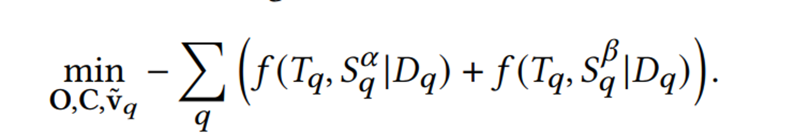
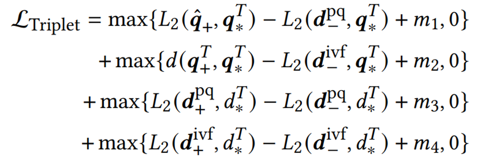

### Sep 26, 2023 Updates

---

### List of Things Done / To-do
- [ ] Run SPANN, Test what's the actual benchmark, tune ANCE HNSW, Falconn, PQ compare
    - [x] [Sep 23] Simulate SPANN 1,000,000 random vector
    - [x] [Sep 24] [Solved by Luo Qi] T5-ANCE trainset embedding
    - [x] [Sep 26] Shared data directory constructed for embedding sharing
    - [x] [Sep 26] Build index for T5-ANCE training set (SSD, BKT, L2, ID as metadata)
    - [ ] Compute latency and recall graphs (ongoing, don't have truth relevant document yet)
- [ ] Ideas on ANN (I'm trying to digest the ideas from some recent papers, but not yet got a clear idea yet)
- [ ] Figure out one line index building using indexBuilder.exe (need to process the input due to format, not prioritized but could explore if needed)

---

### SPANN Index Building Time Stats

    Embedding Dimension: (8841823, 768)
    Nodes: 2
    Task per Node: 1
    CPU per Task: 2 (81.85%)
    mem: 32G (41.09% of 64G)
    GPU per Task: 2

#### BUILD
    - Time took: 0:07:22.002059
#### TEST SEARCH 100 queries
    --k number of relevant document to retrieve
    - k = 85 took: 0:00:00.904727; 0:00:00.010644 on average
    - k = 90 took: 0:00:00.936149; 0:00:00.010402 on average
    - k = 95 took: 0:00:00.912728; 0:00:00.009608 on average
    - k = 100 took: 0:00:00.904318; 0:00:00.009043 on average

#### Notes on SPTAG
- PYTHONPATH doesn't work -> need to set manually
- QuickstartGuide notebook problematic -> use GettingStart.md and adapt from Tutorial notebook
- Build by adding:
    - Build the whole thing at once gives out of memory error
    - Add 100000 embeddings each time -> very fast

---

### Paper Reading and Discussion

#### Distill-VQ:
- Jointly learn IVF and PQ
- Trainable parameters: IVF centroids, PQ codebooks, query encoder
- Fixed document embeddings
- Doesn’t rely on labeled data
- Method: 
    - Well-trained document encoder: fixed document embedding
    - Quantization by IVFPQ
    - Knowledge distillation: let reconstruct embedding imitate dense embedding
        - Teachers: document and query embeddings -> predict query's relevance to sample documents
        - Students: reconstructed embeddings -> reproduce the predicted relevance
        - Objective: 
- Similarity Function: 
    - ListNet: preserve ranking order
        - Variant of KL-divergence
        -  Entropy of normalized predicted scores towards the candidate documents by teacher and student
- Candidate Sampling:
    - Top-K relevant
    - In-Batch: other queries' related documents

    ##### My thoughts: 
    - Improve retrieval quality but that advantage would get trivial when codebook is very large
    - Dependent on a good pre-trained document encoder 
    - In-batch negatives might be trivial due to batch size and uninformative samples as argued in ANCE paper 
        - ANCE uses asychronuous index update 
    - It's nice that Distill-VQ work on unlabeled data, but we may benefit from supervised data? 

#### MoMA: (suggested by Yuwei) 
- Trains the augmentation component with latent labels derived from the end retrieval task, paired with hard negatives from the memory mixture
- Option to include target tasks as in-domain knowledge
- Jointly learn the main model and the augmentation retriever component
- Method: 
    - Construct hard negatives of source task with main model weights of timestep (t-1)
    - Retrieve the augmented documents with augmentation retriever weights of timestep (t-1)
    - Train main model (ANCE) with source task documents
    - Use updated attention score to form positive augmented documents, and retrieve hard negatives augmented documents with augmentation retriever weights of timestep (t-1)
    - Train the augmentation retriever (ANCE)

    ##### My thoughts: 
    - Intuitively this should improve model performance as it includes task domain when introducing the augmented documents, but I think this is not the current focus of us. It might be better if we could directly tackle the two problem discussed last week considering mixtures of memories?
        - Embeddings are very important. 
        - When we introduce the large corpus for augmentation, we have a larger dataset for the ANN index to hold and might result in the case where we have to make more duplicates for boundary vectors.  

### Contrastive Distillation (Still on progress but here's the main points): 
- Incorporate contrastive learning and knowledge distillation
    - Supervised
    - Concatenate negative/positives when computing relevance score for KD
- Learning objectives:
    - infoNCE loss
        - Learn IVF, PQ, dense embedding 
        - Weighted summation of query, PQ and IVF
    - Triplet Distillation Loss: 
        - Enforces a distilled ranking condition: the positive pair ranks higher (by having lower distance measure) than the negative pair
        - 
    - Probabilistic Knowledge Transfer
- Multiple experiments on variations:
    - SoTA: learnable doc and query encoder

My thoughts: 
- Contrastive distillation seems reasonable in terms of improved recall rate. Even though the SoTA includes learnable document encoder, which is fixe in Distill-VQ
- Latency not mentioned

